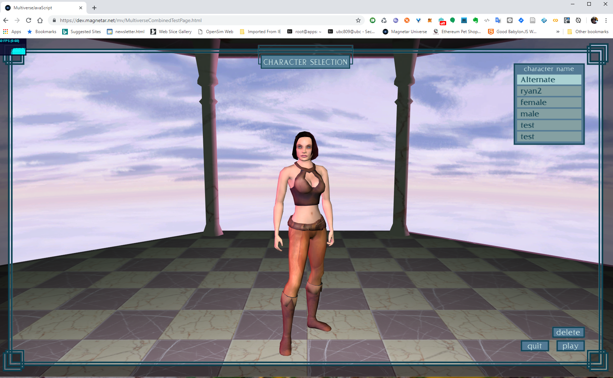
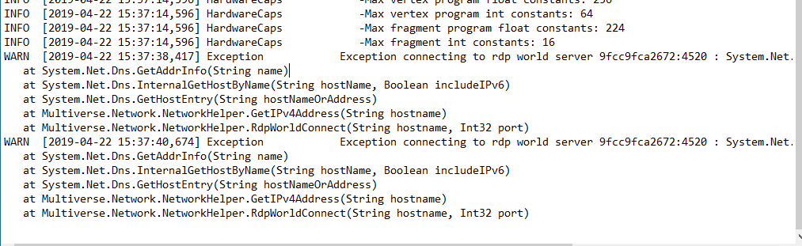
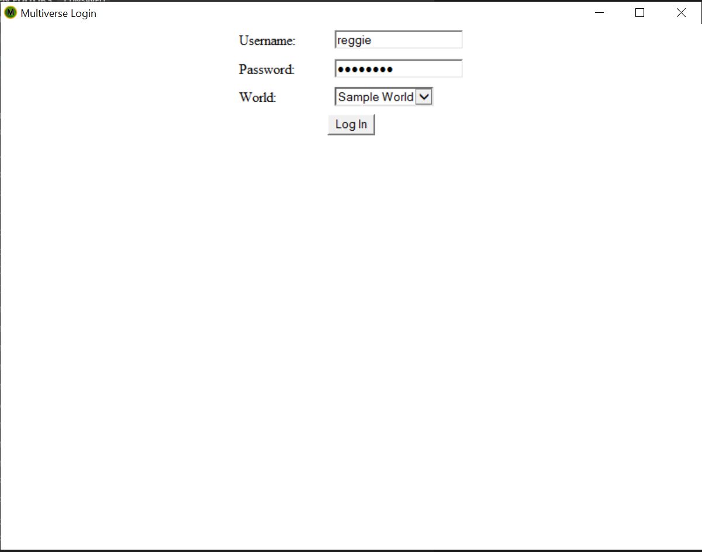
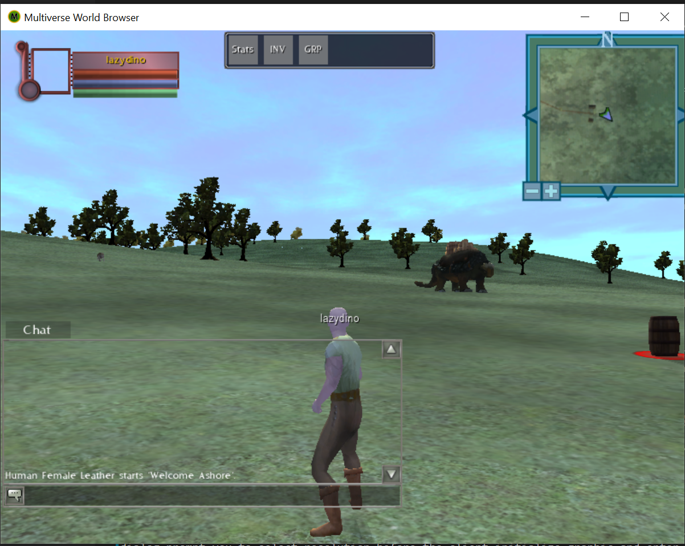

## Game Client Installation Guide.

Multiverse Network is no longer operated since 2012. Besides the [WebGL client](https://dev.magnetar.net/mv/MultiverseCombinedTestPage.html) under development at Magnetar, the client viewer component originally done in C# .NET will not run unless special command line options and host name resolution are specified and fixed.  Here are the step by step instruction to resurrect the .NET client viewer to work with the MMO server running at magnetar.

WebGL client:

### .NET Viewer Setup.
 
1. Request an user account from Magnetar.
You will need an user id and password created in the server side first to try Multiverse. Contact reggie@magnetargames.com to request a test account.
 
2. Downloading the client components of Multiverse.
Visit http://sourceforge.net/projects/multiverse3d/files/ and download the following files.
MultiverseToolSetup.exe  
ClientSetup.msi  
SampleAssets.zip  

3. Set up local repository.  
Unzip SampleAssets.zip, put it on your c:\sampleworld. Run MultiverseToolSetup.exe, and invoke the ‘Asset Importer’ tool to assign default repository. Click on ‘File|Designate Repository’ , and do ‘browse and add directory’ to add “c:\sampleworld” there. Exit the tool

 
3. Install multiverse client.
Run clientSetup.msi to install the client. You might need to install “DirectX sdk” to make the ‘managed directx’ component working for the client.  Do this later in the last step if things don’t work out.

 
4. Create a batch file for the game viewer ( *with elavated trust, "Run as administrator"*).  
Go to the ‘bin’ directory of your installed multiverse client. The default bin is located at  “C:\Program Files (x86)\Multiverse Software Foundation\Multiverse Client\bin”, create a batch file with the following command line parameters:  
```MultiverseClient --tcp --noupdate --login_url http://mvlogin.magnetar.net/login/login.jsp --master apps.magnetar.net --world sampleworld --use_default_repository```  
Due to one of the server quirks of the demise of multiverse.net, compensate the network resolution with the following exception entry observed in **C:\Users\\[user]\Documents\Multiverse World Browser\Logs\Exception.log**  
  


When this happened, update **C:\Windows\System32\drivers\etc\hosts** with entry to resolve 9fcc9fca2672:4520 connection exception by appending 
```142.93.153.79  9fcc9fca2672```  
The 9fcc9fca2672 is actually the 'hostname' of the **docker instance** deployed everytime from dokku.
 
5. Test the client.  
Run the client, supply the testing credential. After successful login in the first time, you might see a dialog prompt you to select resolution before the client initialized graphic and entered the lobby for “character selection”. If you got stuck at this point,  you might need to go to Microsoft’s DirectX site to install DirectX SDK to gain the managed component working for Multiverse….

.NET Client running in Windows 10:  



 

 


 